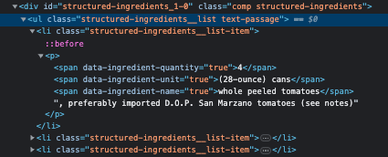

# Retro Guess the Word Game

Partially doing this project again for a good review of vanilla JS but also doing it to restyle it use a different word database.

There are quite a few things that need to happen before a user's guess is accepted and counted towards either the word or remainin guesses. As a dev you want validate everything is good before running a guess thru a function/process. It was challenging for me to figure out what to do first and how to make the functions dependant on one another. I don't think there is a right way but some ways may not be as effiecent.

1. get a word from the database
2. show the user placeholder bullets for the letters of the word
3. grab the value of the guess after button is clicked
4. validate that the guess is a single letter
5. change the case of the guess, check it against letters already guessed, store as a guessed letter if its a fresh guess
6. display the guessed letters
7. change case of word and turn word sting into an array
8. if the guess is included in the word array then display letter instead of the placehoder bullet
9. check to see if player has won

## String To Placeholder Array

This little for-of-loop is something I want to remember how to do

```
  const string = "string";

  const stingToArray = function (string) {
    const stingLetters = [];
    for (const array of string) {
        console.log(array);
        stingLetters.push("●")
        console.log(stingLetters);
    }
  };

  stingToArray(string);
```

## Event Handlers

Basic structure for an event handler. The differences between JS and React are hard to keep track of and I keep trying to add `ref={this.input}`

```
    var body = document.querySelector("body");

    document.addEventListener( "keydown", function(e) {
        if (e.key === "l") {
            body.classList.add("light");
        }
    });
```

Remember e is just a common choice for event listeners and sometime is will be written as event or maybe another variable all together.

To prevent page from re-loading after an event use `e.preventDefault();` inside the call back function of event handler

## Validating a Guess

The variable input is just a dummy varaible. Anything variable can be run through this validator function which makes it re-usable. This validator also uses a Regular expression pattern with `match()` to check that the guess is a letter from A to Z.

```
    const validateInput = function(input) {
        const acceptedLetter = /[a-zA-Z]/; //Regular expression
        if (input.length === 0) {
            playerMessage.innerText="Please enter a single letter as a guess";
        } else if (input.length > 1 ) {
            playerMessage.innerText = "Only enter a single letter as a guess";
        } else if (!input.match(acceptedLetter)) {
            playerMessage.innerText = "Guess on a single letter from A to Z";
        } else {
            return input
        }
    };
```

### Regular Expressions or Regex

Great resource for regular expressions [Regex](https://developer.mozilla.org/en-US/docs/Web/JavaScript/Guide/Regular_Expressions/Cheatsheet)
The regular expession I used `/[a-zA-Z0-9\W]/` includes lower and uppercase letters `a-zA-Z`, numbers `0-9`, and non-word characters from the Latin alphabet `\W`.

## Storing/Comparing a Valid Guess

Once a guess has been validated then it needs to be case homoginized. Remember that JS is case sensitive. This is why the regular expression is `/[a-zA-Z]/` After changing to upper or lower case the guess needs to be compared to prevously guessed letters. If the letter has already been guessed then let the user know. If not then store the guess in the guessed letters array.

## Displaying the Guessed Letters

Two JS methods that I have forgotten since diving so far into React were `createElement()` and `append()`
Basic structure of updating a ul/ol with new data from an array

```
    const diplayNewList = function () {
        //clear items in list
        lettersGuessedList.innerHTML = "";

        for (const letter of guessesArray) {
            const li = document.createElement("li");
            li.innerText = letter;
            lettersGuessedList.append(li);
        }
    };
```

I am still not clear on when an parameter/argument is/is not needed for a function. This function is a good example of what is not clear to me. Sidenote the parameter is the variable passed into a function while the argument is the actual value.

## Updating Placeholder and Remaining Guesses

First the word needs to be transformed into soemthing that can be compared to the guessedLetters. So all caps and in an array that the guessed letters can be compared to. The hard part is figuring out how to update the placeholder bullets. The placeholder array peeled off letters from the word in string form and added a bullet point for each in its array. Un-doing that was not straight forward for me. The way to do it is to make a new array and then use a for-of-loop to compares and either find a match or replace with placeholder bullet.

```
  const revealWord = [];
  for (const letter of wordArray) {
    if (guessedLetters.includes(letter)) {
      revealWord.push(letter.toUpperCase());
    } else {
      revealWord.push("●");
    }
```

## Counting Remaining Guesses

I initially nested if statements into if statments trying to verify that `remainingGuesses > 0` before taking other actions. It is not necessary to do this and just makes it hard to debug. Also wasn't sure if `guess` or `goodGuess` should be used as the parameter for the countGuesses function. Went with using `guess` and then only running function if `goodGuess` exists just like I did with the makeGuess function.

## Check Win

Was so caught up in comparing arrays that I over complicated this. All that needs to be done is to check the word string against the wordInProgress string with an `===`.

## Generating Words

Used an ansync function to get random words for the game. Tidbits to remember are `const wordArray = words.split("\n");` takes a long text list of words and uses the line break \n as a deliminator to make an array. To get a random word use `Math.floor(Math.random()` multiplied by the length of the wordArray to get an random index and hence a random word from the wordArray. Be sure to trim off any white spaces by using trim().

## API

Attempted to use an API to source cocktails names. This API uses php.
The json chrome extension reads the random.php file just fine but it won't work being fetched in the local enviromment.
Throws a CORS error and wants the api to be in http or https to fetch data.
This is the API: www.thecocktaildb.com/api/json/v1/1/random.php

Used cors-anywhere.herokuapp.com to overcome the CORS error I kept getting when fetching data from the API. Not sure how long this solution will work because this [app](https://github.com/Rob--W/cors-anywhere/issues/301) made me apply for temporary access???

If you want to get this app to work you have to visit [temporary permission](https://cors-anywhere.herokuapp.com/corsdemo)

Did all the above crazy complicated stuff to fix and simple probelm. Initially I had 
```
    const response = await fetch(
        "www.thecocktaildb.com/api/json/v1/1/random.php"
    ); 
```
when I should have had 
```
    const response = await fetch(
        "https://www.thecocktaildb.com/api/json/v1/1/random.php"
    );
```
leaving off the https is an obvious noobie mistake 😆

Key take away for me from this was if the problem isn't common and the solution isn't simple you have done something fundementally wrong.

## Play Again

One thing that tripped me up with the event handler for the Play Again button was there being no need to use e as parameter, ie `function(e)`. This event is not storing any data or user response and as soon as it is clicked the button dissapears so the `e.preventDefault()` is not needed. This button really is only refresh on game

## Graphics

I made the graphics in Canva

## Favicon

Made a favicon in Canva at a 550px X 550px size and save as a .png file. I think that this may need to be changed to a .io file to ensure that it can be viewed across browsers. I am also unclear on the size requirements for a favicon. Quick search returns that it should be 16px or 32 px? 

## Displaying Recipe

Wanted to have the cocktail recipe display after the correct name is guessed. 

Breakdown of what needs to be done to accomplish this.
1. get the name of the cocktail, recipe instructions, ingredients, and image from data pulled via API
2. display this only if the user wins the game 
3. have an html/css structure that grabs only available data
2. clear recipe if user wants to play another game

Looked at how Serious Eats displays their ingredients and gained a lot of insight on what might be possible for pulling the measurments and items for existing ingredients. The ``<span>`` elelments seem to have "true" constraints in the CSS.
 
